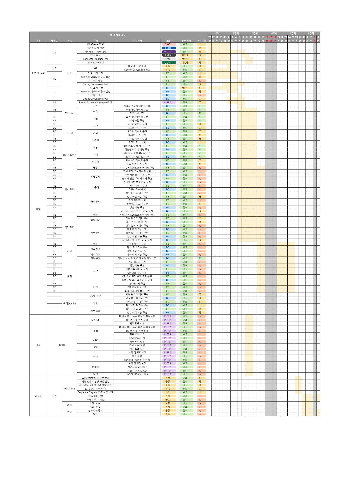
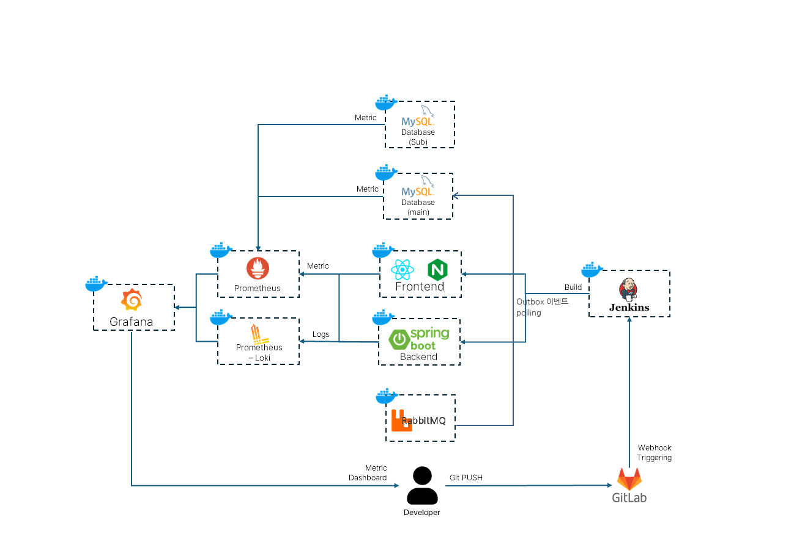

# 사내대장부 ( 기업과 제휴 식당 간의 디지털장부 서비스 )

**SSAFY 11기 특화 프로젝트 E201 슈팅스타**
2024.08.19 ~ 2024.10.11

# 목차

1. 프로젝트 개요
2. 서비스 화면
3. 개발 환경
4. 활용 기술
5. 프로젝트 산출물
6. 팀원 소개 및 역할
7. 개발 회고

---

</br>

# 1. 프로젝트 개요

## 1-1. 프로젝트 소개

기업과 제휴 식당 간의 수기 장부 작성 시스템을 디지털화한 온라인 장부 서비스입니다.

## 1-2. 기획 배경

현재 기업과 제휴된 식당 또는 공사 현장의 함바집에서는 직원들이 수기 장부나 종이 식권을 통해 거래 기록을 남기는 것이 일반적입니다. 이 과정에서 직원들은 점심시간에 하나뿐인 장부에 기록을 남기기 위해 긴 줄을 서서 기다리며, 직접 칸을 찾아 기록해야 하는 불편함을 겪습니다. 기업 측에서는 식권깡, 영수증 처리, 종이 장부 관리 등으로 인해 불필요한 비용이 발생하며, 정산 과정에서 발생하는 혼란과 비효율성도 문제입니다. 또한, 식당 측에서는 계약 관계의 불명확성으로 인해 식대 지급의 연체, 미지급 등으로 인한 분쟁 발생의 위험 부담이 항상 있으며, 종이 장부의 부정확한 관리가 함바 비리 등의 범법 행위로 이어지기도 합니다.

더욱이 종이 장부는 실시간으로 정보를 공유할 수 없기 때문에 기업과 식당 간의 정산과 확인을 위해 직원들의 영수증 점검과 한 달치 기록 확인 등의 번거로운 과정을 거쳐야 합니다.
이는 업무의 효율성을 떨어트리고 많은 비용을 발생시킵니다.

대한민국 직장인의 식대 시장 규모는 약 30조~35조 원으로 추산되며, 이 시장의 디지털화를 통해 비용 절감과 효율성 향상이 크게 기대됩니다​.

## 1-3. 주요 기능

#### 1) 소개 페이지 (microsite)

    - 서비스 소개 : 서비스의 주요 목적 및 특징 소개
    - 이용 방법 안내 : 기업, 식당, 직원이 각각 어떠헤 서비스를 이용하는지 안내
    - 혜택 설명 : 디지털 장부 서비스의 효율성과 비용 절감 효과에 대한 정보 제공

#### 2) 기업 도메인

    - 대시보드 : 기업의 전체 식사 현황과 각 부서별 식사 현황을 그래프로 제공
    - 부서 및 직원 관리 : 부서별 관리자 계정 및 부서별 직원 관리 기능
    - 계약 관리 : 제휴 식당과의 계약 정보 관리 및 사업자등록증 업로드 및 OCR을 통한 계약 요청 및 수락 기능
    - 장부 확인 : 실시간으로 각 식당에서 기록된 식사 내역을 확인하고, 월별 및 직원별 기록 관리
    - 정산 및 세금계산서 관리 : 월말 간편 정산 기능과 세금계산서 확인 기능을 제공하여 정확하고 효율적인 결산 지원

#### 3) 식당 도메인

    - 대시보드 : 식당의 전체 식사 현황을 메뉴별, 기간별, 기업별로 그래프로 제공
    - 계약 관리 : 제휴된 기업과의 계약 정보 관리 및 사업자등록증 업로드 및 OCR을 통한 계약 요청 및 수락 기능
    - 장부 확인 : 실시간으로 기록된 직원들의 식사 내역을 확인하고, 월별로 정리된 기록 관리
    - 정산 및 세금계산서 관리 : 기업과의 거래 내역에 따라 정산 예정 금액 및 미수금, 정산 완료 금액을 확인하고 세금계산서 업로드 기능
    - 메뉴 관리 : 식당에서 판매하는 메뉴를 등록하고 관리하며, 각 메뉴의 가격 수정 기능
    - 식사 장부 작성 : 식당에서 식사한 직원들의 내역을 디지털 장부에 실시간으로 기록

#### 4) 직원 도메인

    - 식사 장부 작성 : uuid 코드를 담은 QR 코드를 통해 간편하게 디지털 장부 작성
    - 월 식대 이용 현황 확인 : 직원의 월별 식대와 당일까지 사용한 식대 확인
    - 제휴 식당 확인 : 직원이 이용 가능한 제휴 식당 목록 제공
    - 장부 내역 확인 : 직원은 본인의 식사 내역을 월별로 확인 가능
    - 모바일 최적화 : 모바일 환경에서 사용하기 편리하도록 최적화

## 1-4. 개발 일정

[Gantt 차트](https://docs.google.com/spreadsheets/d/1BhlEvRPiiJJ7jkJCSPwxe9j7EQzL6mKscQ7ktS3pI1o/edit?usp=sharing)


# 2. UCC & 시연

[영상 보러가기](https://drive.google.com/file/d/1IvOJBnWZPmaNnS-uKDM5M_gQZqTUmoRr/view?usp=drive_link)

# 3. 개발 환경

## 3.1. 서비스 아키텍처

### 시스템 아키텍쳐




## 3.2. Frontend

```
- Node: 22.3.0
- Typescript: 5.5.3
- Vite: 5.4.0
- React: 18.3.1
- mui: 5.16.7
- axios: 1.7.4
- dayjs: 1.11.13
- i18next: 23.13.0
- qr-scanner: 1.4.2
- sonner: 1.5.0
- zustand: 4.5.5
- mirageJs: 0.2.0-alpha.3
- eslint: 8.57.0
```

## 3.3. Backend

```
- Java JDK: Temurin Java-21
- SpringBoot 3.3.3
- JPA: 3.1.5
- Atomikos: 6.0.0
- QueryDsl: 5.0.0
- Quertz: 3.3.4
- JaCoCo: 0.8.12
```

## 3.4. Server

```
- AWS EC2 xlarge(lightsail) + Ubuntu 20.04 LTS
- Nignx 1.18.0
- Docker 27.2.0
- Jenkins 2.462.2
```

## 3.5. DB

```
- MySQL
```

## 3.6. 형상 / 이슈 관리

```
- Jira
- GitLab
```

# 4. 활용 기술

# 5. 프로젝트 산출물

- [기능명세서](https://www.notion.so/yurikim1/v2-c2fcc9e71c4445c19f13c3406977d754)
- [API 명세서-기업](https://www.notion.so/yurikim1/API-11221c2740b980f68fb9e82ca14613fe)
- [API 명세서-식당](https://www.notion.so/yurikim1/API-ce1743e6a9eb48bfa6471885de84de5a)
- [ERD](https://dbdiagram.io/d/%EC%82%AC%EB%82%B4%EB%8C%80%EC%9E%A5%EB%B6%80-66d66da2eef7e08f0e7bd338)
- [Sequence Diagram](https://www.notion.so/yurikim1/Sequence-Diagram-45c7b847c99b415fb354ffcd8090affc)
- [포팅 메뉴얼](https://www.notion.so/yurikim1/0113aaaafa3446378149b6b80147cda9)
- [MockUp](https://www.figma.com/design/PmUDowuXsVW1IgytApIgUK/E201?node-id=0-1&t=VaZ80EBMtog0KU9p-1)

# 6. 팀원 소개 및 역할

- 김송희 | _팀장_ | FE - 임직원 도메인, React Native Webview 로 App 생성 / 최종 발표
- 김강진 | Infra, BE - 계약,정산 도메인, 외부 API 연동
- 김유리 | FE - 기업 도메인 / PPT
- 김재경 | DB 설계, BE - 식당 도메인
- 이준혁 | _BE장_ | BE - 기업 도메인 / UCC
- 황세웅 | _FE장_ | FE - 식당 도메인, 프론트엔드 전체 프로젝트 리뷰 및 최종 디벨롭 / 중간 발표
